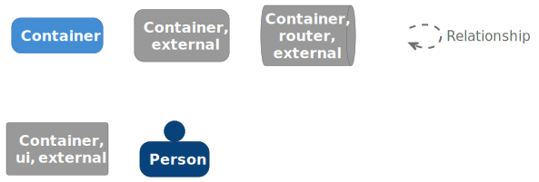

# 05 Building Block View
## 5.1 Whitebox Overall System
**Summary:** WhisperCMS is a modular, hexagonal content engine composed of isolated domains communicating through typed events and versioned storage.

### **Purpose**
WhisperCMS delivers a secure, extensible architecture for content modeling, publishing, and site delivery. It is divided into **core**, **extension**, and **interface** layers — all governed by strict safety and abstraction rules.

### **Top-Level Components**

| Component | Description |
| --------- | ----------- |
| **Core Engine** | Domain layer that defines content entities, workflows, metadata, and taxonomy. Manages persistence, revisioning, and policy enforcement. |
| **Server Runtime** | Web-facing delivery process (Pingora + Axum) that hosts themes, serves content, and dispatches events to plugins. |
| **Desktop Admin Runtime** | Local-first Tauri + Leptos application used for configuration, extension management, and site publishing. |
| **Extension Host** | Isolated execution environment for plugins and themes, with Rhai sandbox and capability-based API. |
| **Persistence Layer** | Dual data model: Git as system-of-record and SQLite/LibSQL for runtime transactions and indexing. |
| **Event Bus** | Reactive message broker (Leptos Reactive) that routes events and commands between trusted and untrusted code. |
| **Policy and Security** | Cedar and ROPS enforce authorization and secure secret handling. |
| **CLI Interface** | Command-line control surface for setup, migration, and maintenance operations. |

All these components are implemented in **Rust**, ensuring type safety and zero-cost interaction.

## 5.2 Level 1: Core Structure and Boundaries
**Summary:** The system core follows the hexagonal pattern, separating the domain from its adapters and infrastructure.

### **Domain Layer**
Defines core concepts:
- **Content Entity**: text, metadata, and taxonomy models.
- **Workflow**: draft → revision → publish state machine.
- **Policy**: authorization rules and capability definitions.
- **Identity**: administrative, machine, and extension identities.

### **Application Services**
Implements:
- Content modeling, revisioning, and validation.
- Event dispatching and subscription management.
- Transaction coordination between Git and SQLite.

### **Adapters**
Provide integration with external actors:
- **Plugins/Themes** → via the Event Bus.
- **CLI/Desktop Admin** → via structured commands.
- **HTTP Server** → via Axum routes and Pingora ingress.

### **Infrastructure**
Implements:
- Local persistence (SQLite/LibSQL).
- Version control (Git).
- Telemetry, filesystem I/O, and runtime configuration.

## 5.3 Level 2: Server Runtime
**Summary:** The server runtime orchestrates ingress, routing, extension dispatch, and response generation.

### **Main Building Blocks**
| Element | Description |
| ------- | ----------- |
| **Ingress Controller (Pingora)** | Edge entry point; validates request safety and forwards traffic to the web server. |
| **Web Server (Axum)** | Core HTTP router that maps routes to themes and triggers event dispatches. |
| **Theme Engine** | Theme packages handle presentation logic via HTTP method handlers (GET, POST, etc.). |
| **Plugin Runtime** | Sandboxed Rhai environment executing event-driven plugins. |
| **Event Bus (Leptos Reactivity)** | Connects server requests and extension actions through facts and rules. |
| **Content Repository** | Git-based content store providing immutable commit history and rollback. |
| **Local Database (SQLite/LibSQL)** | Caches structured content, metadata, and precomputed indexes. |
| **Security & Policy Layer** | Enforces Cedar-based authorization and verifies access scope. |
| **Telemetry** | Tracing crate provides observability across layers. |

### **Runtime Flow (from delivery diagram)**
1. Request arrives → Ingress validates → Theme route matched.
2. Theme dispatches request events to plugins.
3. Plugins may emit content, metadata, or response modifications.
4. Theme renders via Minijinja templates.
5. Response written to stream → Plugin processing finalized.

## 5.4 Level 3: Desktop Admin Runtime
**Summary:** The desktop admin provides a local management interface built with Tauri and Svelte, communicating through a secure custom protocol.

### **Main Building Blocks**
| Element | Description |
| ------- | ----------- |
| **Tauri Core** | Rust application container managing the WebView, filesystem, and Git commands. |
| **Leptos UI** | Web-based administrative interface for content and extension management. |
| **Custom Scheme (`wcms:`)** | Secure protocol bridging the Svelte frontend to Rust backend commands. |
| **Git Client** | Clones, commits, and synchronizes repositories for configuration and content. |
| **Local Persistence** | Manages site settings via `settings.toml` and local Git metadata. |
| **Admin Console** | Handles configuration flows for plugins, themes, and core system. |

### **Startup Flow**
1. User opens WhisperCMS → system checks for existing `settings.toml`.
2. Initializes Git repository or connects to remote.
3. Loads configuration and extensions.
4. Displays admin console (themes, plugins, site settings).
5. Executes admin actions through local Rust backend.

## 5.5 Extension Subsystem
**Summary:** Extensions are untrusted modules that interact only through event-driven APIs within secure sandboxes.

### **Key Components**
| Component | Description |
| --------- | ----------- |
| **Extension Host** | Manages sandbox creation, lifecycle, and communication. |
| **Rhai VM** | Sandboxed scripting environment executing plugin logic. |
| **Manifest Parser** | Validates declared capabilities and version compatibility. |
| **Event Interface** | Exposes structured event types: request, content, response. |
| **Theme Adapter** | Bridges theme commands (HTTP handlers) to content templates. |
| **Plugin Adapter** | Subscribes to content and response events for controlled modification. |

### **Extension Boundaries**
- No direct access to filesystem or network unless declared.
- No reflection or dynamic linking.
- Capability declarations verified at load time.
- Communication via event and command facts only.

### Extension Architecture Overview
WhisperCMS extensions operate within a reactive runtime powered by Leptos and scripted through Rhai. This design unifies Plugins and Themes under a single, safe, high-performance execution model, while providing developers with expressive power similar to WordPress — without its runtime hazards. The architecture defines a strict boundary between what extensions can observe, compute, and propose, and what only the host can ultimately apply or write. All reactive state flows through typed signals, and all data transformations occur through host-provided transform functions that operate on those signals.

### Reactive Foundation
Every extension—Plugin or Theme—executes inside a Leptos reactive runtime hosted by WhisperCMS. The host provides a finite, type-safe set of signals that represent the state of a request and its associated content:
- Request signals (method, path, version, headers, body)
- Content signals (metadata, body)
- Response signals (status, headers, body – read-only to plugins)
- Proposal signals (aggregated plugin proposals – visible to themes)
- Auxiliary signals

Each signal represents a reactive source managed by the host. When a signal changes — for example, when new content metadata is loaded or response headers are updated — any reactive effects depending on that signal automatically re-execute.

### Execution Context and Rhai Safety
Both Plugins and Themes run as Rhai scripts. Each script executes under strict Rhai budgets that cap operation count, recursion depth, string and array size, and map complexity. These limits are set once at the engine level and apply uniformly to all extensions. They ensure scripts cannot monopolize CPU or memory while avoiding extension-specific quota systems. Because all DB, HTTP, Filesystem, and transformation work is initiated through Rhai functions, the same Rhai budgets naturally govern both computation and orchestration logic. The host enforces no additional quotas beyond Rhai’s own sandbox limits.

### Signals, Accessors, and Transforms
A core principle of the design is that Rhai itself performs all logical comparisons and conditional reasoning, while the host performs only necessary transformations.

### Signal Accessors
A single per-request instance, sig, returns typed handles to existing reactive sources (no creation happens—just cheap, cloned handles to host-owned signals).

#### sig.req.*(request)
- method() -> StringSignal
- path() -> StringSignal
- version() -> StringSignal
- headers() -> MapSignal
- body() -> BodySignal
#### sig.content.*(content)
- meta() -> MapSignal  ← the only content “header-ish” map
- body() -> BodySignal
#### sig.resp.*(response; read-only for plugins)
- status() -> I64Signal
- headers() -> MapSignal
- body() -> BodySignal
#### (Theme-only) sig.plugins.* → aggregated plugin proposals
- status() -> I64Signal(or Option-like wrapper, depending on your design)
- headers() -> ArraySignal<Map>(if you expose as a small array)
- transforms() -> ArraySignal<Map>
#### Typed handles & methods
- StringSignal: .get() -> String
- I64Signal: .get() -> i64
- MapSignal (generic map view):
	- .get_str(key) -> String
	- .get_bool(key) -> bool
	- .get_i64(key) -> i64
	- .has(key) -> bool
- BodySignal: no direct .get(); but transform methods that return primitives.

All reads happen inside create_effect, so Leptos dependency tracking “just works”. With these accessors, Rhai scripts can perform ordinary comparisons and conditional logic natively (e.g., if method.get() == "GET" && path.get().starts_with("/blog/") { … }).

### Transform Methods
Where a computation requires heavy processing or stream inspection, the signal exposes transform methods. These methods always return primitives — never new signals or streams. They encapsulate work that would otherwise force the extension to materialize large bodies in memory and serialize across the boundary.

Examples include:
- Counting words in a streamed body
- Matching a regular expression across an HTML or JSON stream
- Computing a hash or checksum
- Counting nodes matching a CSS selector within HTML
- Checking for the existence of a JSON pointer

Each transform runs inside the Leptos effect, reads its input signal to register dependencies, performs its work efficiently in the host, and yields a primitive result back to Rhai. This keeps extensions lightweight while preserving full reactivity.

### Plugins vs. Themes
WhisperCMS distinguishes between Plugins and Themes by capability rather than language or structure.

### Plugins — Reactive Observers and Proposers
Plugins observe signals, perform analysis via accessors and transforms, and propose changes to the eventual response. They cannot directly modify the response stream or headers. Plugins submit three kinds of proposals, all represented as small, serialized primitives:
1. Status suggestions - propose_status(code)
2. Header additions - propose_header(name, value)
3. Transform descriptors - propose_transform(map)

Transform descriptors define what modification a Plugin suggests (for example, “insert this HTML snippet before </head>”) but not how or when it executes. Each descriptor is a simple map specifying the operation type, selector, insertion position, and conditions such as content type or path prefix. Plugins can use full CSS-style selectors inspired by lol_html, with complexity bounded by Rhai’s string and array limits.

### Themes — Reactive Executors and Writers
Themes are the only extensions permitted to read the request, apply proposals, and write responses. A Theme reads Plugin proposals through dedicated signals (aggregated by the host), filters them according to policy, and applies them using specialized engines:
- HTML transforms via `lol_html`
- JSON transforms via `jaq`
- Templating and layout via `minijinja`

Themes may also render layouts, set the response status and headers, and control the final response stream. All of these are actions rather than transforms; they operate at write time and do not return data to Rhai. This division of responsibility preserves safety: Plugins can never directly mutate output, and Themes retain complete control over what actually reaches the client.

### Phases of Execution
Each request passes through four conceptual phases:
1. Observe — Signals are created and populated.
2. Propose — Plugins execute reactive effects, analyze signals, and propose changes.
3. Apply — The Theme reads aggregated proposals, resolves order and conflicts, and applies them using its transformation engines.
4. Finalize — The Theme writes the completed response stream and closes the reactivity scope.

Effects run only in their appropriate phase; invoking actions out of phase yields a clear error, ensuring predictable ordering and preventing feedback loops.

### Capability Manifests
Every extension declares a Capability Manifest specifying which signal domains it may read and which APIs it may call. The manifest is checked at load time and used to register only the relevant host functions into that extension’s Rhai environment. This limits the accessible surface area without creating bespoke quotas or per-extension rules. Capabilities are additive but not hierarchical—Themes require write:* capabilities, whereas Plugins maybe restricted to read:* and propose:*.

### Observability and Traceability
Each request produces a structured trace that records:
- All signals read by each extension
- Proposals submitted (status, headers, transforms)
- Filters and ordering decisions made by the Theme
- Final applied operations and results

In development mode, this trace can be returned through diagnostic headers (X-Theme-Trace, X-Proposals-Applied) or logged for interactive replay. A “dry-run” mode allows the host to evaluate Plugin logic without applying proposals, supporting extension testing and tuning.

###  Lifecycle and Isolation
All signals, effects, and Rhai contexts are scoped to a single request. When the request completes, the Leptos runtime and all signals are disposed, guaranteeing no cross-request state leakage. Extensions cannot persist runtime state except through explicit database writes (subject to read-only or safe-write policies).

###  Developer Experience
Extension authors work in Rhai exclusively, using a clean, predictable API surface:
- Simple introspection through signal accessors
- Efficient analysis through host transforms returning primitives
- Safe participation via proposals
- Automatic reactivity without manual event wiring

The design emphasizes power with predictability: developers can observe, compute, and propose freely within Rhai’s sandbox, while WhisperCMS enforces deterministic, reactive, and safe application of their work.

### Benefits
This approach delivers a reactive, type-safe, and sandboxed extension framework where:
- The host defines a finite, typed set of reactive signals.
- Rhai scripts perform all ordinary logic and comparisons locally.
- The host provides only true transforms (signal → primitive) for heavy work.
- Plugins remain pure proposers; Themes are the sole writers.
- Rhai budgets provide universal resource limits.
- The system is fully observable, deterministic, and phase-safe.

It preserves the expressive freedom that made WordPress extensible while eliminating its runtime fragility, giving developers power bounded by clear, enforceable safety guarantees.

## 5.6 Persistence and Version Control Subsystem
**Summary:** Persistence is dual-layered — Git for immutability and SQLite/LibSQL for local speed.

### **Main Elements**
| Element | Description |
| ------- | ----------- |
| **Git Repository** | Stores site content, configuration, and history; forms the system-of-record. |
| **SQLite/LibSQL Engine** | Provides fast local querying, indexing, and transaction validation. |
| **Sync Engine** | Promotes validated local commits to Git. |
| **Schema Mapper** | Ensures deterministic serialization of content and metadata. |

**Data Flow**
1. Author modifies content locally → SQLite transaction created.
2. Transaction validated and serialized to Git.
3. Commit pushed to remote repository.
4. Server or desktop consumes latest Git state at startup.

## 5.7 Security and Policy Subsystem
**Summary:** Security spans all layers — policy enforcement, secret isolation, and sandboxing.

### **Core Components**
| Component | Description |
| --------- | ----------- |
| **Cedar Policy Engine** | Evaluates fine-grained authorization policies. |
| **ROPS Secrets Manager** | Manages encrypted secrets, keys, and tokens. |
| **Session Management** | Uses HMAC-signed cookies (`tower-sessions`) for authentication. |
| **Sandbox Enforcer** | Mediates plugin and theme capability scope. |
| **Ingress Validator** | Verifies all external inputs before routing to themes. |

## 5.8 CLI Subsystem
**Summary:** The CLI provides automation and operational control over WhisperCMS instances.

| Component | Description |
| --------- | ----------- |
| **Clap Interface** | Command definition and parsing for setup and maintenance tasks. |
| **Git Operations** | Clone, pull, commit, and sync actions. |
| **Content Scanner** | Parses raw files into structured data for SQLite population. |
| **Plugin/Theme Manager** | Installs, upgrades, and validates extensions. |
| **Server Control** | Starts and stops web and ingress services. |

## 5.9 Summary
**Summary:** The building block view defines WhisperCMS as a layered, event-driven, and sandboxed CMS engine.

- **Core Layer**: Domain logic and application services.
- **Server Layer**: Ingress, routing, and web delivery.
- **Desktop Layer**: Local-first admin control and Git synchronization.
- **Extension Layer**: Sandboxed plugins and themes with reactive events.
- **Persistence Layer**: Git + SQLite ensuring traceability and speed.
- **Security Layer**: Cedar, ROPS, and sandbox enforcement.

**Result:**
A modular, verifiable system that delivers performance and extensibility without violating safety or determinism.
