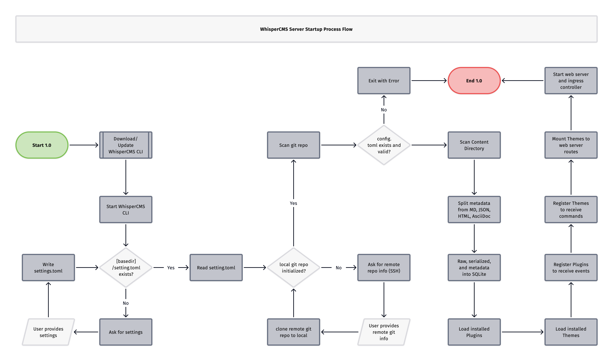
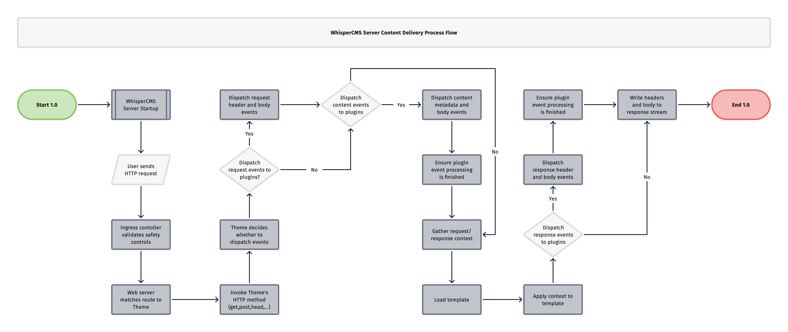
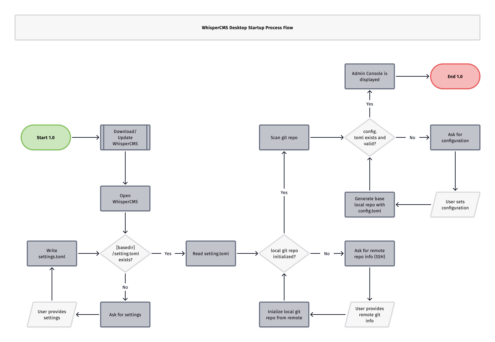
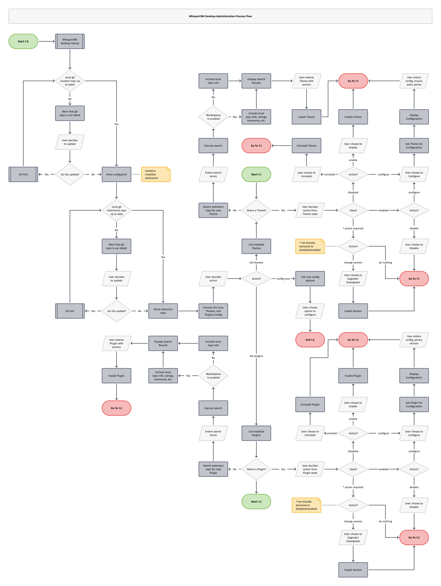

# 06 Runtime View
## 6.1 Overview
**Summary:** WhisperCMS defines explicit, deterministic runtime sequences for startup, content delivery, and administrative workflows.

WhisperCMS emphasizes **predictability, traceability, and isolation** during execution.
Each runtime flow is statically defined to prevent untrusted code from influencing core initialization, I/O, or content delivery paths.

Runtime behavior falls into three categories:
1. **Server Startup Flow** – initialization and registration of core components.
2. **Server Content Delivery Flow** – user-facing request handling and theme rendering.
3. **Desktop Administration Flow** – configuration, extension management, and publishing.

Each flow maps directly to the architectural diagrams and enforces the system’s safety priorities.

## 6.2 Server Startup Flow
**Summary:** The server runtime initializes by establishing configuration, synchronizing repositories, and registering extensions within sandboxed contexts.

### **Primary Actors**
- **User / Administrator**
- **CLI / WhisperCMS Server Process**
- **Git Repository**
- **SQLite/LibSQL Database**
- **Plugin and Theme Loaders**
- **Web Server (Axum)**
- **Ingress Controller (Pingora)**

### **Sequence**

(derived from *WhisperCMS-server-startup-flow.pdf*)

1. **Start CLI or Server Process**
   - Entry point via `whispercms` binary (`clap`-based).
   - Reads or generates `settings.toml`.

2. **Repository Initialization**
   - If no local Git repo: clone from remote via SSH.
   - If existing: verify integrity and update configuration.

3. **Configuration Validation**
   - Parse and validate `config.toml`.
   - Exit gracefully if missing or invalid.

4. **Content Ingestion**
   - Scan content directories.
   - Split metadata (frontmatter) from markdown, JSON, HTML, or AsciiDoc using `gray_matter`.
   - Populate SQLite/LibSQL with structured data and metadata.

5. **Extension Registration**
   - Load all installed Plugins and Themes.
   - Register Plugin event handlers and Theme command routes.
   - Each extension runs in a **sandboxed Rhai VM** with explicit capabilities.

6. **Web Server Bootstrapping**
   - Mount Theme routes in Axum web server.
   - Bind network ports and initialize Pingora ingress controller.
   - Start event bus (Ascent) and tracing layers.

7. **Ready State**
   - WhisperCMS listens for incoming requests.
   - System guarantees that no extension executes before the server is fully initialized.

**Key Properties:**
- Deterministic startup order.
- No untrusted code execution during initialization.
- Git provides a verifiable system baseline at runtime start.

## 6.3 Server Content Delivery Flow
**Summary:** The server handles HTTP requests through controlled routing, event dispatch, and template rendering while maintaining sandbox isolation.

### **Primary Actors**
- **End User (Browser)**
- **Ingress Controller (Pingora)**
- **Web Server (Axum)**
- **Theme Engine**
- **Plugin Runtime**
- **Event Bus**
- **Persistence Layer (SQLite + Git)**

### **Sequence**

(derived from *WhisperCMS-server-delivery-flow.pdf*)

1. **Ingress Validation**
   - Pingora receives the HTTP request.
   - Validates against safety rules (e.g., rate limits, allowed methods).
   - Forwards to the Axum web server.

2. **Routing**
   - Axum matches request paths to the active Theme’s HTTP handlers (GET, POST, HEAD…).
   - Theme selected based on site configuration and route patterns.

3. **Event Dispatch (Request Stage)**
   - Event Bus emits “request received” as state changes into a reactive system.
   - Plugins subscribed to request/content events execute asynchronously in Rhai sandboxes.

4. **Content Resolution**
   - Server queries SQLite for relevant content, metadata, and taxonomies.
   - Plugin events may enrich or transform metadata before rendering.

5. **Rendering**
   - Theme loads associated template (Minijinja).
   - Applies context data (content + metadata).
   - Generates HTML stream using `lol_html` for transformations.

6. **Event Dispatch (Response Stage)**
   - Event Bus emits “response prepared” events.
   - Plugins may alter headers or streaming body segments.

7. **Response Completion**
   - Axum writes headers and body to the response stream.
   - Waits for all plugin event processing to finish.
   - Returns finalized response to the user.

**Key Safeguards:**
- Plugin execution isolated from core logic.
- Events are typed and time-bounded.
- No blocking or unsafe thread access to runtime state.
- Tracing spans capture end-to-end diagnostics for observability.

## 6.4 Desktop Administration Flow
**Summary:** The desktop runtime provides a local-first administrative workflow using Tauri and Svelte, backed by Git synchronization.

### **Primary Actors**
- **User / Administrator**
- **Tauri Runtime (Rust Backend)**
- **Leptos WebView (Frontend)**
- **Git Repositories (Content and Extensions)**
- **Local Filesystem**
- **Extension Marketplace (optional)**

### **Sequence**

(derived from *WhisperCMS-desktop-startup-flow.pdf* and *WhisperCMS-desktop-admin-flow.pdf*)

1. **Application Launch**
   - User opens WhisperCMS Desktop.
   - System checks for existing `settings.toml` under `[basedir]`.

2. **Configuration Initialization**
   - If file exists: load configuration.
   - If not: prompt user for remote Git repository details (SSH, mount path, permissions).

3. **Repository Setup**
   - Clone or initialize local Git repo.
   - Parse `config.toml`.
   - Create base configuration if missing.

4. **Console Startup**
   - Load extensions (themes and plugins) from local repo.
   - Parse manifests and verify version compatibility.
   - Display admin dashboard (core, themes, plugins, configuration).

5. **Extension Management**
   - User actions (enable, disable, configure, uninstall, upgrade).
   - Each action updates local Git repo and triggers configuration parsing.
   - Marketplace search integrates remote extension metadata if enabled.

6. **Publishing Flow**
   - Git pull → merge → commit → push.
   - Synchronizes local configuration with remote repository.
   - Ensures all state changes are traceable and reversible.

**Key Properties:**
- No central API dependency — all actions local-first.
- Git ensures versioned configuration and reproducibility.
- UI communicates with backend through the `wcms:` custom scheme only.
- Tauri enforces process sandboxing between JS UI and Rust logic.

## 6.5 Event and Extension Runtime Flow
**Summary:** Events are the communication backbone between core, plugins, and themes.

### **Actors**
- **Event Bus (Leptos Reactive)**
- **Plugin Runtime (Rhai)**
- **Theme Handlers**
- **Core Services**

### **Sequence**
1. Event emitted (e.g., Request, Content, Response).
2. Event Bus provides reactive signals.
3. Matching plugin effects are triggered.
4. Each plugin executes in isolated Rhai VM with bounded runtime and resource quotas.
5. Plugin may additional effects by modifying context objects (e.g., metadata).
6. Core waits for event completion of effects before proceeding to next stage.

**Properties:**
- Reactive signals instead of imperative callbacks.
- Supports local reasoning and verifiable event flow.
- Explicit cyclic or re-entrant behavior.

## 6.6 Error Handling and Resilience
**Summary:** Error handling follows the “fail-fast, isolate, recover” principle.

- **Snafu** ensures typed and contextual error propagation.
- **Failsafe** and **tower-resilience-circuitbreaker** prevent cascading failures.
- **Tracing** captures spans for structured logging and observability.
- **Recovery:** Failed plugin execution is contained and logged; core continues processing safely.
- **Verification:** Configuration, content parsing, and persistence operations validated before commit.

## 6.7 Security and Policy Enforcement
**Summary:** Runtime safety is maintained through layered enforcement mechanisms.

| Layer | Enforcement Mechanism |
| ----- | --------------------- |
| **Ingress** | Pingora validates request safety (CORS, method, headers). |
| **Core Execution** | Cedar evaluates authorization policies before sensitive actions. |
| **Extension Host** | Rhai VM enforces sandbox boundaries; capability-based access. |
| **Persistence** | Git cryptographically secures commits; unauthorized mutations rejected. |
| **Secrets** | ROPS manages encrypted secrets accessible only to trusted components. |

These guarantees ensure no untrusted code can alter system behavior outside its declared scope.

## 6.8 Summary
**Summary:** WhisperCMS runtime flows are deterministic, observable, and safe.

- **Startup Flow:** Deterministic initialization and safe registration.
- **Delivery Flow:** Event-driven request handling and templated response generation.
- **Admin Flow:** Local-first configuration and extension management.
- **Extension Flow:** Typed, sandboxed event execution with bounded cost.

**Result:**
A runtime architecture that is *predictable, verifiable, and secure by design* — supporting the project’s core mission: *Safety first, zero-cost abstractions everywhere.*
