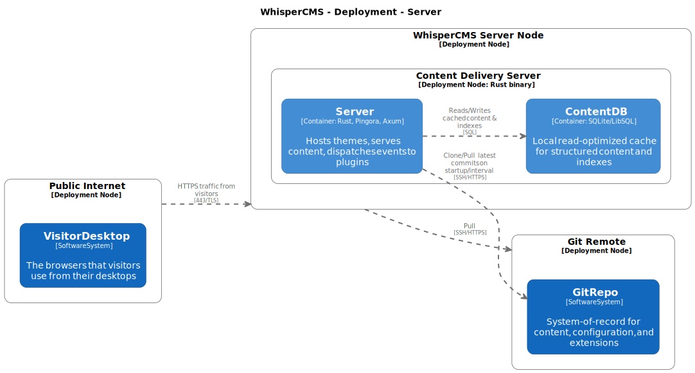
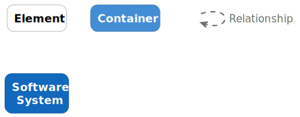
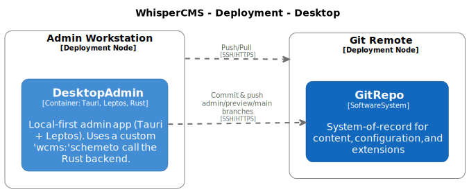

# 07 Deployment View
## 7.1 Overview
**Summary:** WhisperCMS uses a hybrid deployment architecture combining local-first administration, Git-based synchronization, and isolated server runtimes.

The system consists of two primary deployable artifacts:

1. **WhisperCMS Server** – hosts content delivery, plugin execution, and public site rendering.
2. **WhisperCMS Desktop Admin** – provides a local, offline-capable administration environment.

These two components communicate only through **Git repositories**, not through direct API calls.
Git serves as the **synchronization and audit boundary**, ensuring all configuration and content are versioned and verified.

## 7.2 Deployment Context Diagram
**Summary:** The deployment context defines how WhisperCMS interacts with users, external services, and infrastructure boundaries.

**Key Concept:**
Git acts as the **delivery and control channel** between admin and server, replacing traditional REST or RPC interfaces.

## 7.3 WhisperCMS Server Deployment
**Summary:** The server is a standalone Rust binary running the Axum web server and Pingora ingress controller, connected to Git and SQLite.




### **Runtime Components**
| Component | Description |
| --------- | ----------- |
| **Binary** | Compiled Rust executable (`whispercms-server`). |
| **Ingress Controller (Pingora)** | Edge layer for request validation and forwarding. |
| **Web Server (Axum)** | Hosts routes mapped to active Theme handlers. |
| **SQLite / LibSQL** | File-based local data store for indexing and fast queries. |
| **Filesystem Mounts** | For content, templates, and media. |
| **Extension Sandboxes** | Isolated Rhai environments for plugins. |
| **Cedar Policy Engine** | Enforces runtime authorization rules. |
| **ROPS Secrets Store** | Manages credentials and keys securely. |

### **Deployment Environment**
- **Host OS:** Linux or macOS (bare metal, VM, or container).
- **Dependencies:** None required beyond system libc and OpenSSL.
- **Networking:**
  - HTTP/HTTPS on configurable ports.
  - SSH access to remote Git repositories.
- **Persistence:**
  - Git repository cloned under `/var/lib/whispercms/site/` or user selected directory.
  - SQLite database located under `/var/lib/whispercms/site/content.db` or user selected directory.
- **Startup Command:**
  ```bash
  whispercms-server --config /etc/whispercms/settings.toml
  ```

  ### Lifecycle
1. Clone or update Git repository on start.
2. Populate SQLite from repository content.
3. Load and sandbox plugins/themes.
4. Start Pingora + Axum stack.
5. Serve requests and dispatch events.
6. Periodically pull Git updates for content sync.

## 7.4 WhisperCMS Desktop Deployment
**Summary:** The desktop admin is a cross-platform Tauri application embedding a Svelte frontend and Rust backend.




### Deployment Characteristics
| Aspect | Description |
| ------ | ----------- |
| **Platform** | Windows, macOS, Linux. |
| **Distribution** | Packaged as `.app`, `.exe`, or AppImage via Tauri build. |
| **Core Binary** | Rust-based backend with custom protocol wcms: for secure UI to backend calls. |
| **Frontend** | Leptos single-page app (embedded WebView). |
| **Storage** | Local Git repositories in user home directory. |
| **Connectivity** | SSH for remote Git pushes/pulls; no open network ports. |
| **Security Model** | Tauri isolates JS frontend from file I/O; all privileged actions routed via Rust backend. |

### Deployment Flow
1. User installs WhisperCMS Desktop from release bundle.
2. On first run, the app asks for:
	- Repository location (local or remote).
	- Credentials (SSH keys or tokens).
	- Desired site directory.
3. Tauri backend initializes Git repo and writes settings.toml.
4. User interface launches, rendering the admin console.
5. User performs local actions (enable plugins, configure themes, edit content).
6. Commits pushed to remote Git repository — propagating changes to the server.
**Result:**
Desktop Admin operates fully offline, only requiring Git access for synchronization.

## 7.5 Git Repository Deployment
**Summary:** Git repositories form the integration and distribution boundary for configuration, content, and extensions.

### Repository Roles
| Repository | Purpose |
| ---------- | ------- |
| **Content Repository** | Stores site data, configurations, and user-generated content. |
| **Extension Repository** | Contains marketplace or local plugin/theme manifests. |
| **Remote System-of-Record** | Centralized Git origin used for production deployment. |

### Example Branch Structure
| Branch | Purpose |
| ------ | ------- |
| **main** | Live production state. |
| **admin** | Staging and configuration previews. |
| **preview** | Temporary local working branch for admin changes. |
Each branch is auditable; merges correspond to promotion events (e.g., staging → production).

## 7.6 Deployment Scenarios
**Summary:** WhisperCMS supports three typical deployment topologies.

### Scenario A: Local-Only (Offline Mode)
- Desktop Admin and Server both run on the same machine.
- Useful for single-user or development setups.
- Git repository is local; no network access required.

### Scenario B: Distributed Site
- Desktop Admin on local workstation.
- Server hosted remotely (e.g., VPS, container, or bare metal).
- Both share a common Git remote (e.g., GitHub, Gitea, self-hosted).
- Admin pushes commits; server pulls updates.

### Scenario C: Multi-Instance Deployment
- Multiple WhisperCMS servers (edge nodes) clone from the same Git repository.
- Each instance serves identical content but operates independently.
- Suitable for high-availability or CDN-style distribution.
- SQLite databases remain local per instance; Git ensures eventual consistency.

## 7.7 Container and Cloud Deployment
**Summary:** WhisperCMS Server can be containerized with minimal dependencies.

### Containerization
- Base Image: rust:slim or alpine for minimal footprint.
- Container contents:
	- Compiled whispercms-server binary.
	- /site directory mounted for Git and SQLite.
	- Config volume for settings.toml.
- Example Dockerfile:
```dockerfile
FROM rust:alpine
COPY whispercms-server /usr/local/bin/
WORKDIR /site
CMD ["whispercms-server", "--config", "/site/settings.toml"]
```

### Cloud Hosting
- **Stateless container** model: each pod pulls Git updates and serves locally.
- **Persistent storage**: use mounted volumes for Git repo and SQLite.
- **Scaling**: horizontal scale-out with a shared Git remote ensures consistency.
- **Monitoring**: expose tracing data and health checks over HTTP endpoints.

## 7.8 Security and Deployment Boundaries
**Summary:** Deployment boundaries reinforce WhisperCMS’s architectural safety priorities.

| Boundary | Description |
| -------- | ----------- |
| **Git Boundary** | The only synchronization channel between admin and server. No RPC or REST APIs. |
| **Ingress Boundary** | All external HTTP requests validated by Pingora before routing. |
| **Extension Boundary** | Plugins and themes sandboxed and cannot access system files or sockets. |
| **Desktop Boundary** | Tauri enforces process isolation; Svelte UI cannot invoke Rust APIs directly. |
| **Secret Boundary** | ROPS restricts credentials to specific service layers (never exposed to extensions). |

## 7.9 Summary
**Summary:** WhisperCMS’s deployment strategy emphasizes safety, determinism, and simplicity.
- **Server:** Standalone Rust binary with zero runtime dependencies.
- **Desktop:** Local-first Tauri app managing Git-backed configuration.
- **Git:** Acts as the synchronization, audit, and distribution mechanism.
- **Optional Marketplace:** Distributed as a separate Git source.
- **Deployment Model:** Scales horizontally with immutable version control as truth.

**Result:**
A secure, reproducible, and decentralized deployment model — aligning with WhisperCMS’s principles of *Safety first, no hidden complexity, and zero-cost abstractions.*
