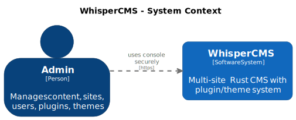
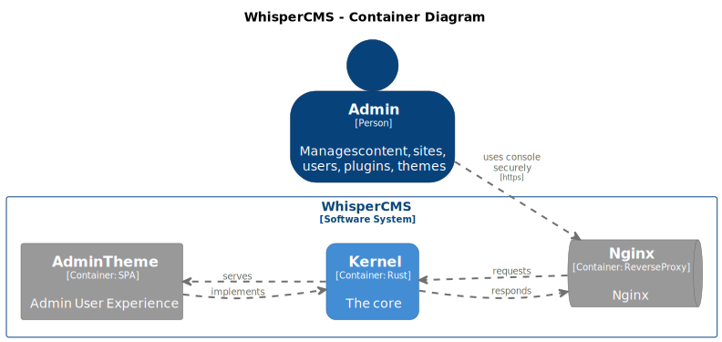
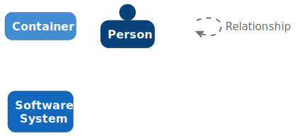
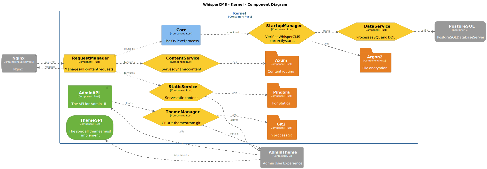
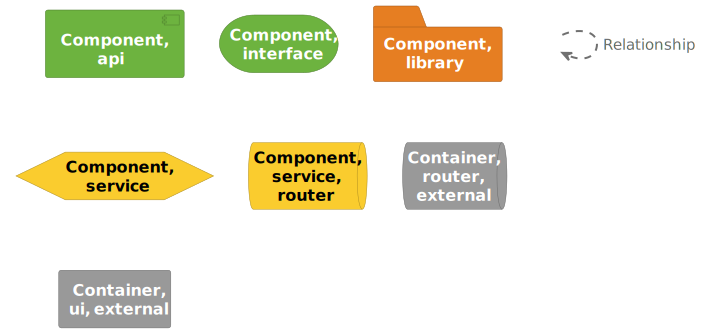
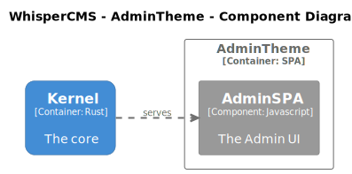
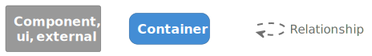

# WhisperCMS Architecture

This document describes the architecture of **WhisperCMS**, a multi-site,
Rust-based content management system (CMS) with a Wordpress inspired plugin and
theme system.

---

## 📜 Introduction to the C4 Model

This architecture document is written using the **C4 Model**, a simple,
structured approach to documenting software architecture.

### ✅ What is the C4 Model?

The **C4 Model** describes your system at **four levels of detail**:

1. **Context Diagram** – What is the system? Who uses it? What other systems
   does it interact with?
2. **Container Diagram** – What major applications or services does it have? How
   do they communicate?
3. **Component Diagram** – What are the key internal building blocks of those
   applications?
4. **Code (Optional)** – The classes, methods, or detailed structure of the
   codebase itself.

By defining these levels, the C4 Model helps everyone understand **how the
system is built and how it works**, from high-level goals to low-level
internals.

👉 For more details, see the official site:  
🔗 [https://c4model.com/](https://c4model.com/)

### ✅ Why Use the C4 Model in Open Source?

Documenting an open source project with the C4 Model helps:

- **New contributors** understand the system quickly.
- **Maintainers** stay aligned about architecture decisions.
- **Reviewers** see the big picture during PRs.
- **Users** know how to deploy and integrate the system.
- **Teams** onboard faster and share consistent mental models.

Open source projects often struggle with fragmented, out-of-date, or missing
architecture docs. The C4 Model gives us **a standard, structured way** to
communicate clearly.

### ✅ How This Document Uses the C4 Model

This document includes:

⭐ A **System Context** section – explains who uses WhisperCMS and its external
dependencies.  
⭐ A **Container Diagram** section – breaks the system into major deployable
services and apps.  
⭐ Detailed **Component sections** – describes internal services and libraries
for developers.

This layered approach makes it easier for **anyone**—from end users to core
contributors—to understand how WhisperCMS works and how to extend it.

---

## Naming Conventions

- Roles are lowercase
- Systems, contains, and components are capitalized
- Relationship should be verbs and lowercase
- Use `*Interface` suffixes for system, containers, and components that specify
  interfaces that 3rd parties must implement
- Use `*API` suffixes for systems, containers, and components that implement
  contracts

---

## 📌 System Context

### System Overview Diagram

#### System Overview Diagram Key

**Actors:**

- **Admin**: A human who manages content, sites, users, plugins, and themes.

**Software System:**

- **WhisperCMS**: A multi-site Rust CMS that supports theming, plugins, and rich
  administrative features.

**Main External System:**

- **Nginx**: Acts as a secure reverse proxy for HTTPS traffic.

---

## 📌 Container Diagram

WhisperCMS is composed of several **containers**, each with a clear role:

### Containers Diagram

#### Containers Diagram Key

### 1️⃣ Kernel

> The core Rust server application that handles all dynamic CMS logic.

**Responsibilities:**

- Plugin and theme interfaces
- Admin API
- Serving static assets
- Configuration management
- Initial setup
- Routing requests
- Managing themes

**Key technologies:**

- Rust
- Async runtime
- Libraries: Pingora, Git2

---

### 2️⃣ AdminTheme

> The administrative user experience for site management.

**Characteristics:**

- Implemented as an SPA (Single-Page Application) in JavaScript.
- Interacts with the Kernel via the AdminAPI.
- Implements the shared ThemeInterface.

**Responsibilities:**

- Providing UI for content management
- Managing plugins, themes, and users

---

### 3️⃣ Nginx

> An external reverse proxy used for secure HTTPS access.

**Responsibilities:**

- TLS termination
- Routing requests to the Kernel
- Serving admin console securely

---

## 📌 Detailed Containers & Relationships

### ✅ Kernel

The _Kernel_ is the heart of WhisperCMS. It includes:

### Kernel Component Diagram

#### Kernel Component Diagram Key

- **ThemeInterface** _(interface)_

  - Contract that all themes must implement.

- **AdminAPI** _(api)_

  - The HTTP API used by the AdminTheme.

- **StaticService** _(service)_

  - Serves static content like the Admin UI bundle or theme assets.

- **SettingsService** _(service)_

  - Manages configuration not stored in the database.

- **SetupService** _(service)_

  - Handles first-time setup and initialization.

- **RequestManager** _(service, router)_

  - Central router for all content requests.
  - Coordinates services and checks settings.

- **ThemeManager** _(service)_

  - CRUD operations for themes (pulled from git).

- **Pingora** _(library)_

  - High-performance Rust-based reverse proxy used as an internal library.

- **Git2** _(library)_
  - Rust bindings for in-process Git operations.

**Kernel Relationships:**

- SetupService → ThemeManager (loads themes during setup)
- RequestManager → SettingsService (checks settings)
- RequestManager → SetupService (starts setup flow)
- RequestManager → StaticService (forwards static requests)
- StaticService → Pingora (uses for high-performance serving)
- ThemeManager → Git2 (for managing themes from Git)

---

### ✅ AdminTheme

Represents the **Admin UI** for site management.

### AdminTheme Component Diagram

#### AdminTheme Component Diagram Key

**Components:**

- **AdminSPA** (Javascript UI)
  - Single-Page App for managing content, plugins, themes, and sites.

**Relationships:**

- AdminTheme → ThemeInterface (implements)
- AdminTheme → AdminAPI (calls for data)
- StaticService → AdminSPA (serves static assets)
- ThemeManager → AdminTheme (installs themes)

---

### ✅ Nginx

External reverse proxy used to secure and route traffic.

**Responsibilities:**

- Terminates HTTPS connections from Admins.
- Forwards requests to Kernel's RequestManager.
- Returns responses securely to the Admin.

**Relationships:**

- Admin → Nginx ("uses console securely" via HTTPS)
- Nginx → RequestManager (forwards requests)
- RequestManager → Nginx (returns responses)

---

## 📌 📜 Architecture Highlights

✅ **Reverse Proxy Layer:**

- Nginx for TLS, routing, and security.
- Pingora used internally in StaticService for high-performance serving.

✅ **Admin UI:**

- Served as static SPA.
- Consumes AdminAPI exposed by the Kernel.

✅ **Rust Kernel:**

- Core CMS logic.
- Static file serving, plugin/theme management.
- Extensible via interfaces (ThemeInterface).

✅ **Git Integration:**

- Uses Git2 for fetching themes from repositories.

✅ **Separation of Concerns:**

- AdminTheme (UI)
- Kernel (API and services)
- Nginx (proxy)

---

## 📌 📜 Technology Stack Summary

- **Rust**: Core Kernel, StaticService, AdminAPI, Plugin/Theme management.
- **Javascript**: Admin SPA.
- **Nginx**: Reverse Proxy, HTTPS termination.
- **Git2**: Managing themes from Git.
- **Pingora**: High-performance static file serving (Rust library integration).

---

## 📌 Conclusion

WhisperCMS is architected for:

⭐ Secure, multi-site administration  
⭐ Plugin and theme extensibility  
⭐ High-performance static and dynamic serving  
⭐ Clear separation between UI and API  
⭐ Modern Rust design with powerful libraries

This design balances **developer experience**, **performance**, and
**flexibility** for running multiple CMS-powered sites securely and efficiently.
