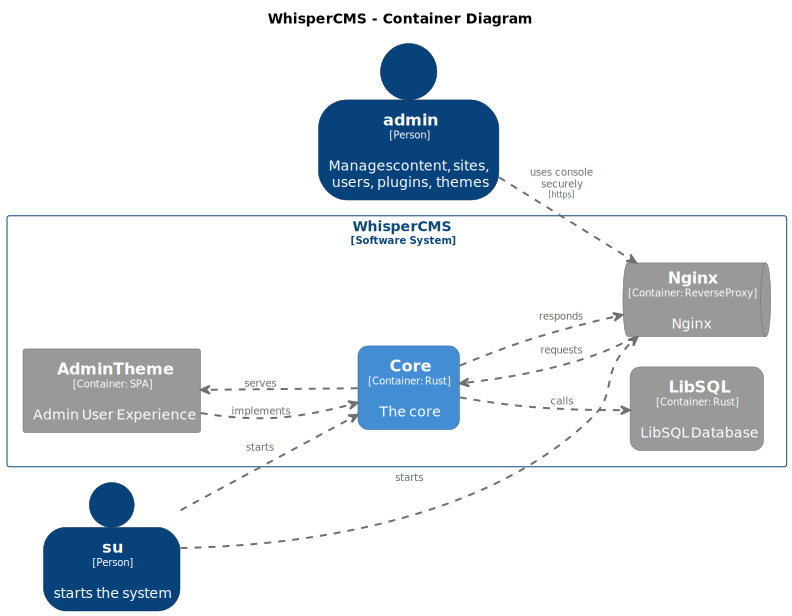
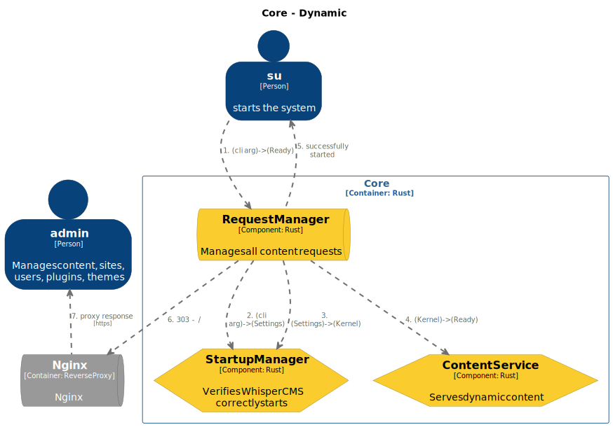
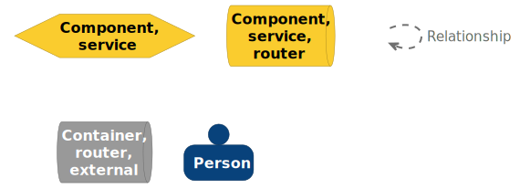
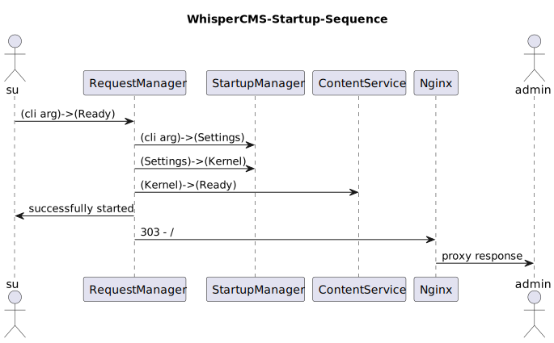
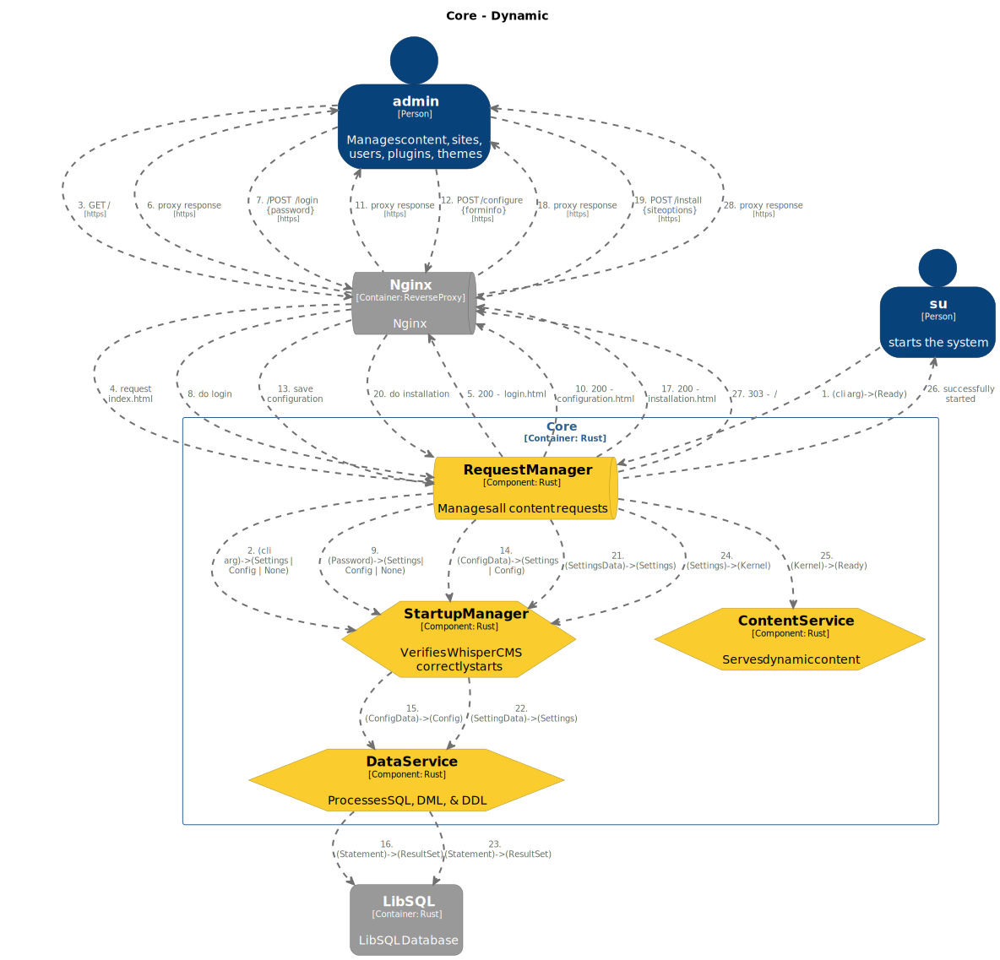

# WhisperCMS Architecture

This document describes the architecture of **WhisperCMS**, a multi-site,
Rust-based content management system (CMS) with a plugin and theme system
inspired by WordPress, but designed with Rust's safety, performance, and modern
tooling in mind.

---

## 📜 Introduction to the C4 Model

### ✅ What is the C4 Model?

The **C4 Model** describes your system at **four levels of detail**:

1. **Context Diagram** – What is the system? Who uses it? What other systems
   does it interact with?
2. **Container Diagram** – What major applications or services does it have? How
   do they communicate?
3. **Component Diagram** – What are the key internal building blocks of those
   applications?
4. **Code (Optional)** – The classes, methods, or detailed structure of the
   codebase itself.

By defining these levels, the C4 Model helps everyone understand **how the
system is built and how it works**, from high-level goals to low-level
internals.

👉 For more details, see the official site:  
🔗 [Learn more about the C4 Model](https://c4model.com/)

### ✅ Why Use the C4 Model in Open Source?

Documenting an open source project with the C4 Model helps:

- **New contributors** understand the system quickly.
- **Maintainers** stay aligned about architecture decisions.
- **Reviewers** see the big picture during PRs.
- **Users** know how to deploy and integrate the system.
- **Teams** onboard faster and share consistent mental models.

Open source projects often struggle with fragmented, out-of-date, or missing
architecture docs. The C4 Model gives us **a standard, structured way** to
communicate clearly.

### ✅ How This Document Uses the C4 Model

This document includes:

⭐ A **System Context** section – explains who uses WhisperCMS and its external
dependencies.  
⭐ A **Container Diagram** section – breaks the system into major deployable
services and apps.  
⭐ Detailed **Component sections** – describes internal services and libraries
for developers.

This layered approach makes it easier for **anyone**—from end users to core
contributors—to understand how WhisperCMS works and how to extend it.

---

## 📌 Naming Conventions

- Use lowercase for roles (e.g. `admin`, `su`).
- Capitalize Systems, Containers, and Components.
- Use `*SPI` for interfaces, `*API` for implementing contracts.
- Use verbs for relationships.
- Use `ThemeSPI`, `AdminAPI`, etc., to clarify purpose.

---

## 📌 System Context

### System Overview

### System Overview Diagram

#### System Overview Diagram Key

**Actors:**

- **admin** – Manages content, users, themes, plugins.
- **su** – Starts the system and performs first-time setup.

**System:**

- **WhisperCMS** – A plugin/theme-enabled CMS written in Rust.

**External Systems:**

- **Nginx** – External HTTPS reverse proxy.
- **LibSQL** – Embedded database for structured data.

---

## 📌 Container Diagram

### Overview

WhisperCMS is organized into the following major containers:

### Containers Diagram

#### Containers Diagram Key

1. **Core** – The Rust backend, managing plugins, themes, static/dynamic
   content.
2. **AdminTheme** – A JavaScript SPA used for administration.
3. **Nginx** – The secure HTTPS reverse proxy.
4. **LibSQL** – The embedded SQL database.

### 📦 Core

- Written in **Rust**
- Contains key services:
  - `RequestManager` – Main router, delegates to internal services
  - `ContentService` – Handles dynamic page rendering
  - `StaticService` – Serves static content (e.g. themes, admin SPA)
  - `StartupManager` – Coordinates setup and initialization
  - `ThemeManager` – Fetches themes from Git
  - `DataService` – Executes SQL and migrations
- Uses:
  - `Pingora` – For static file serving
  - `Git2` – Git operations for themes
  - `Axum` – For routing dynamic requests
  - `Argon2` – For config encryption

### 📦 AdminTheme

- Built as a **SPA** in JavaScript
- Served by `StaticService`
- Implements the `ThemeSPI`
- Communicates via `AdminAPI`

### 📦 Nginx

- External reverse proxy
- Handles TLS termination
- Proxies admin and content requests to `RequestManager`

### 📦 LibSQL

- Used by `DataService`
- Provides a fast, embedded SQL engine
- Supports full-text search, JSON, and high safety guarantees

---

## 📌 Component View (Core)

### Components

### Core Component Diagram

#### Core Component Diagram Key

- **ThemeSPI** – Interface all themes must implement
- **AdminAPI** – REST API for AdminTheme
- **RequestManager** – Routes all requests and controls flow
- **StaticService** – Serves static files using Pingora
- **ContentService** – Renders pages, routes using Axum
- **StartupManager** – Handles initial config and installation flow
- **DataService** – Executes SQL statements via LibSQL
- **ThemeManager** – Downloads and manages themes from Git

### Libraries

- **Pingora** – Used internally by StaticService
- **Git2** – Used by ThemeManager
- **Axum** – Used by ContentService
- **Argon2** – Used by StartupManager for encryption

---

## 📌 Dynamic Views

### System Startup Diagram

#### System Startup Diagram Key

#### System Startup UML Diagram

### System Installation Diagram

#### System Installation Diagram Key

#### System Installation UML Diagram

---

## 📌 Key Design Decisions

### Plugins and Themes

- Loaded via **crates.io** using naming conventions
- Must implement `*SPI` interfaces
- Statically compiled for **maximum safety**
- Additions require **rebuild and restart**

### Configuration

- StartupManager loads config using Argon2 for encryption
- Plugins and themes provide configuration via code, not files
- Updates only affect **new incoming requests**

### Database

- Uses **LibSQL**, a fork of SQLite with:
  - Embedded transactions
  - Native JSON
  - Full-text search
  - Compile-time safety with SQLx

### i18n/l10n

- Provided via an **official plugin**
- Balances flexibility and user experience
- Not built-in to avoid unnecessary complexity for mono-lingual users

---

## 📌 Technology Summary

| Layer          | Technology     |
| -------------- | -------------- |
| Web Proxy      | Nginx          |
| Static Serving | Pingora (Rust) |
| Dynamic Routes | Axum (Rust)    |
| Database       | LibSQL         |
| SCM            | Git2 (Rust)    |
| Encryption     | Argon2         |
| Frontend       | Vue 3 SPA      |
| Plugin Host    | Rust Crates    |

---

## 📌 Conclusion

WhisperCMS is:

- Built for **safety-first** using static typing and Rust
- Optimized for **performance** using minimal, embedded services
- Extensible via **compile-time plugins/themes**
- Designed for **usability** across admin, author, and editor roles

By using C4 and modern architectural principles, WhisperCMS offers a
well-documented, maintainable, and secure platform for developers and end users
alike.
